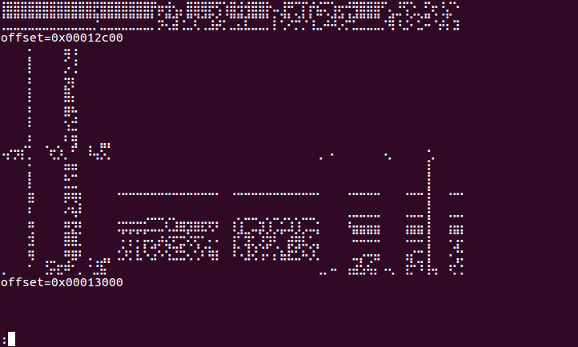
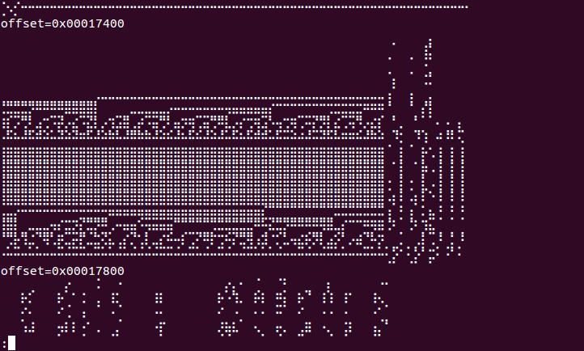
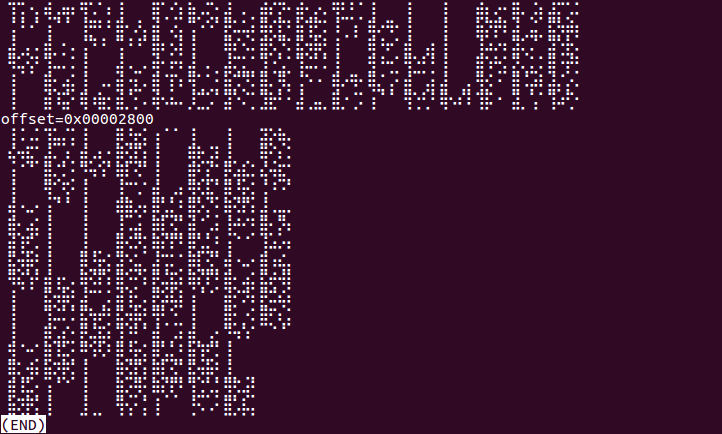

# bits
Visualize bits of a file using braille characters

## Features

* Reads a file or stdin, and visualizes the bits
* Customizable format, including columns, rows, and even z-order
* Options to show file offsets and line numbers
* Supports partial rows/columns on EOF

## Try it out!

Try running the following commands:

    # rows
    [python] bits.py -o -V8 -h128 myfile
    # same thing, using MSB to LSB order
    [python] bits.py -o -B -v8 -h128 myfile

    # columns
    [python] bits.py -o -H8 -v64 -h16 myfile
    # same thing, using MSB to LSB order
    [python] bits.py -o -B -h8 -v64 -h16 myfile

    # The following work especially well with executable files:
    # rows, 8 bytes at a time
    [python] bits.py -o -V64 -h128 myfile
    # one column, 8 bytes at a time
    [python] bits.py -o -H64 -v64 myfile
    # one column, 16 bytes at a time
    [python] bits.py -o -H128 -v64 myfile

    # The following aren't particularly useful:
    # just the bits in a line
    [python] bits.py myfile
    # z-order
    [python] bits.py -o -h2 -v2 -h2 -v2 -h2 -v2 -h2 -v2 -h2 -v2 -h2 -v2 myfile

In place of `myfile`, you can use `$(which ls)` (binary) or even `bits.py` itself (ASCII).

## License

Licensed under GPLv3. See the LICENSE file for details.

Copyright (c) Andrew Li 2017
